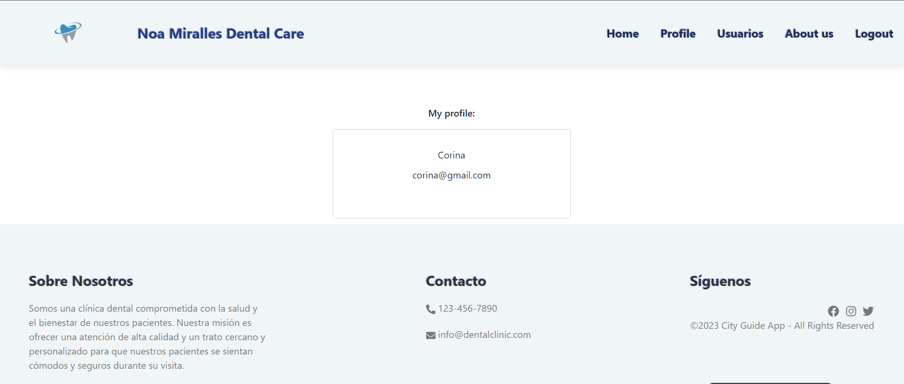
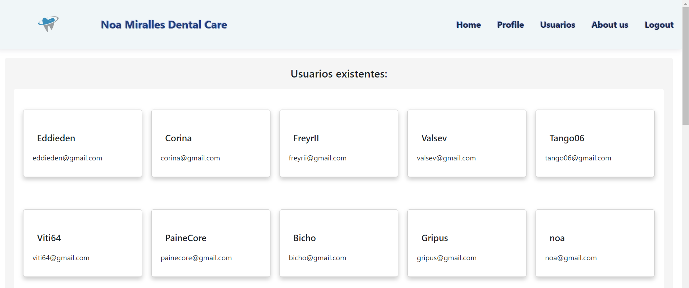
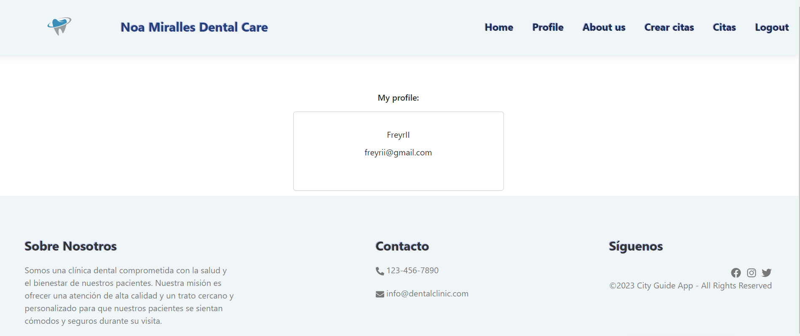

# geekshub_frontend_react_clinica-dental

<em> # Bienvenido a la aplicación Frontend de la clínica dental</em>


### Datos generales

**- Autor del proyecto:** Corina Maria Ciorpac.

**- Título del proyecto:** Ejercicio técnico 5 - Frontend App clinica dental

**- Fecha:** 12/3/2023


 <p align="left">
   
   </p>

<details>
  <summary>Índice</summary>
  <ol>
    <li><a href="#Sobre-este-proyecto">Sobre este proyecto</a></li>
    <li><a href="#Implementación-local ">Implementación Local</a></li>
    <li><a href="#Tecnologías">Tecnologías</a></li>
    <li><a href="#Instalación local">Instalación local</a></li>
    <li><a href="#Cómo-se-ha-realizado-este-proyecto">¿Cómo se ha realizado este proyecto?</a></li>
    <li><a href="#Bugs-conocidos">Bugs conocidos</a></li>
    <li><a href="#Futuras-funcionalidades">Futuras funcionalidades </a></li>
    <li><a href="#Licencia">Licencia</a></li>
    <li><a href="#Webgrafia">Webgrafia</a></li>
    <li><a href="#Agradecimientos">Agradecimientos</a></li>
    <li><a href="#Contacto">Contacto</a></li>
  </ol>
</details>

## Sobre este proyecto 🎯

<p align="center"></p>

<p align="center">El departamento de productos de GeeksHubs solicita la creación del frontend correspondiente al sistema de gestión de citas para una clínica dental, para conectarse con el backend creado en el último proyecto. 
El paciente debe poder registrarse en la aplicación, iniciar sesión y acceder a su área de cliente. En su área de paciente, debería poder ver una lista de citas que tiene, tanto futuras como pasadas, crear citas y ver su propio perfil.
También habrá un área de doctor con sus datos personales, que solo él mismo podrá ver, y ver todos los pacientes.
El administrador es el último usuario que puede acceder a todos los datos personales en la aplicación.</p>

## Implementación 🚀
<div align="center">
    <a href=""><strong>URL de producción</strong></a>🚀🚀🚀
</div>

## Tecnologías
<div align="center">
<a href="https://www.reactjs.com/">
    
</a>
<a href="https://developer.mozilla.org/es/docs/Web/JavaScript">
    
</a>
 <a href="https://redux.js.org/">
    
</a>
<a href="https://react-bootstrap.github.io/">
    
</a>
<a href="https://nodejs.org/en">
    
</a>
<a href="https://github.com/">
    
</a>
<a href="https://git-scm.com/downloads">
    
</a>
<a href="https://aws.amazon.com/es/">
    
</a>
<a href="https://developer.mozilla.org/es/docs/Web/CSS">
    
</a>
<a href="https://developer.mozilla.org/es/docs/Web/CSS">
    
</a>
<a href="https://nextjs.org/">
    
</a>
<a href="https://expressjs.com/">
    
</a>
<a href="https://www.sequelize.org/">
    
</a>
<a href="https://www.npmjs.com/">
    
</a>


## Implementación local


 #Clone the project on your computer
    ` $ git clone 'url-repository' `


 #Install all dependencies
    ` $ npm install `
 
 
 #Create a .env with the credentials on the .env.example


  #Start server with:
    ``` $ npm run dev ```


 #Connect with the database following:
    ``` $ npx sequelize-cli db:create ```
    ``` $ npx sequelize-cli db:migrate ```
    ``` $ npx sequelize-cli db:seed:all ```


#Now is time for frontend project:


 #Clone the project on your computer
    ``` $ git clone 'url-repository ``` 


 #Install all dependencies
    ``` $ npm i ```
 
 #Start server with:
   ``` $ npm run dev ```


#Last step download the dataBase:


[Data base git hub](https://github.com/corina43/geekshubs-fsd-val-proyecto_4.1)


## ¿Cómo se ha realizado este proyecto?


Primero, se clonó el proyecto desde un repositorio remoto de Git y se instaló localmente. Luego, se instalaron todas las dependencias necesarias a través de npm.

Posteriormente, se configuraron los archivos de configuración para permitir la comunicación con el servidor backend, utilizando la biblioteca de JavaScript axios para simplificar la comunicación HTTP.

A continuación, se trabajó en el diseño de la interfaz de usuario, utilizando Bootstrap React como marco de trabajo. Además, se agregaron algunos componentes personalizados y se diseñó el esquema de colores y estilos.

Una vez que el diseño se completó, se comenzó a trabajar en la integración con el backend, creando funciones que llaman a las API del backend a través de axios. Se realizaron pruebas y ajustes para garantizar que la aplicación funcionara correctamente.

Para la creación del frontend de la aplicación de la clínica dental, se implementaron diferentes vistas según el rol de los usuarios. Los pacientes pueden hacer login y logout, crear citas, ver sus citas y su perfil. También se creó una vista para los doctores, que pueden hacer login y logout, ver sus citas y su perfil. Además, se creó una vista para los administradores, que pueden hacer login y logout, ver todos los usuarios y su perfil. También se creó una vista de entrada a la página donde, si el usuario no está registrado, puede hacerlo y, según su rol que se autentifica mediante token, se le remite a la vista correspondiente. Todo esto se realizó renderizando los endpoints creados en el backend.


### Acceso a la aplicación


Datos de acceso como administrador: 

> Mail: corina@gmail.com // Password: 123456

Datos de acceso como paciente: 

> Mail: painecore@gmail.com // Password: 123456

Datos de acceso como doctor: 

> Mail: freyrii@gmail.com // Password: 123456


# Vista entrada Api

<p aling="center"></p>


<p aling="center"></p>


<p aling="center"></p>

<p aling="center"></p>

# Vista paciente


<p aling="center"></p>


<p aling="center"></p>

# Realizacion cita paciente

<p aling="center"></p>
---

<p aling="center"></p>

---

<p aling="center"></p>

# Vista admin

<p aling="center"></p>


<p aling="center"></p>

<p aling="center"></p>

# Vista doctores

<p aling="center"></p>

<p aling="center"></p>

# Vista mobile

<p aling="center"></p>

## Bugs conocidos


✅ Desajustes del footer en vista paciente al crear cita y profile.

⬜ No aparece el nombre del usuario logeado en el NavBar.


⬜ Algunos desajustes de authentificacion provenientes del backend para darle funccionalidad a Crear Pacientes.  

## Funccionalidades futuras


✅ Crear pacientes.


⬜ Crear doctores.


⬜ Crear la funcionalidad para eliminar un usuario por parte del administrador.


⬜ Ser capaz de eliminar y actualizar citas tanto por parte del usuario como del administrador.


⬜ Modificar tanto una cita como el perfil por parte del usuario y administrador.

## Licencia


This project is belonging to license Creative Commons Legal Code.

## Webgrafia:


To achieve the goal we have collected information from:
  [React documentation](https://www.reactjs.com/)

  [React-bootstrap GeeksHubs](https://react-bootstrap.github.io/)


## Agradecimientos:

Agradezco a todos mis compañeros y especialmente a:

  **Dani** 

<a href="https://www.github.com/datata" target="_blank"></a> 

  **Jose**

<a href="https://github.com/JoseMarin" target="_blank"></a> 

  **Mara**

<a href="https://www.github.com/MaraScampini" target="_blank"></a> 

  **David** 

<a href="https://github.com/Dave86dev" target="_blank"></a>

  **Alvaro**

<a href="https://www.github.com/Alvaro" target="_blank"></a>


## Contacto

<a href = "mailto:micorreoelectronico@gmail.com"></a>
<a href="https://www.linkedin.com/in/linkedinUser/" target="_blank"></a> 
</p>


